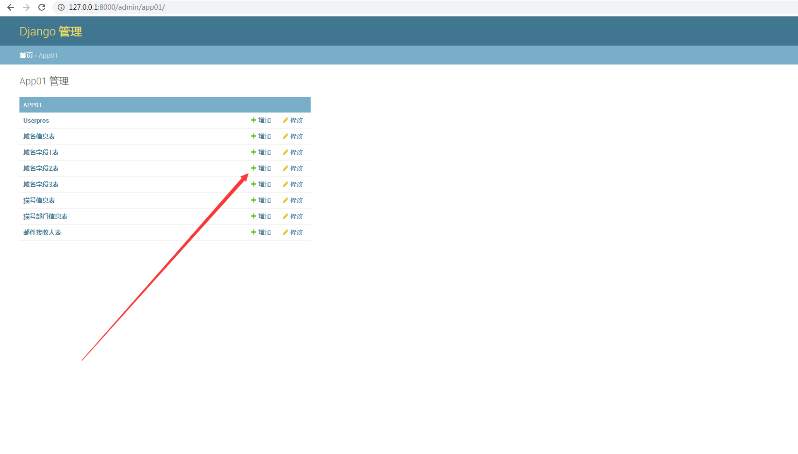
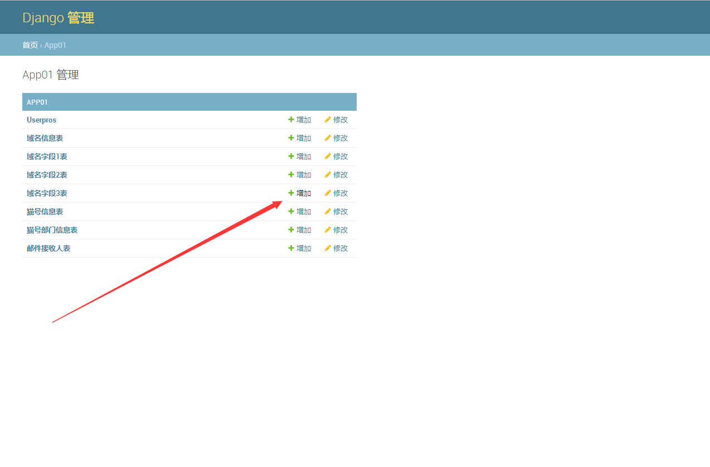
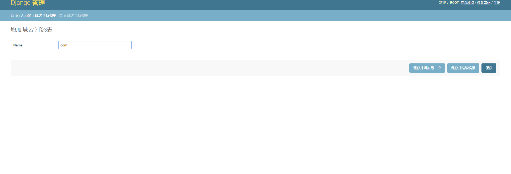
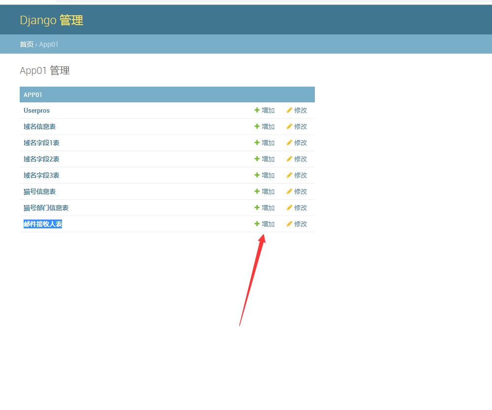
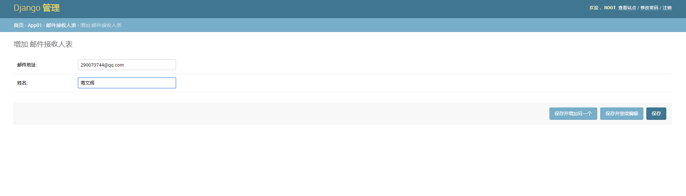
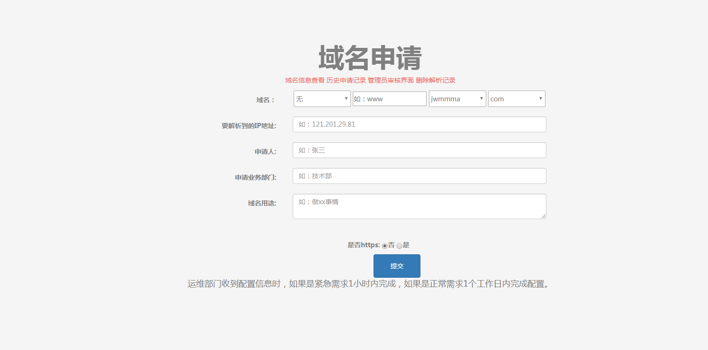
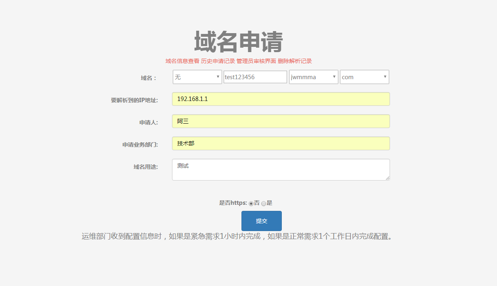
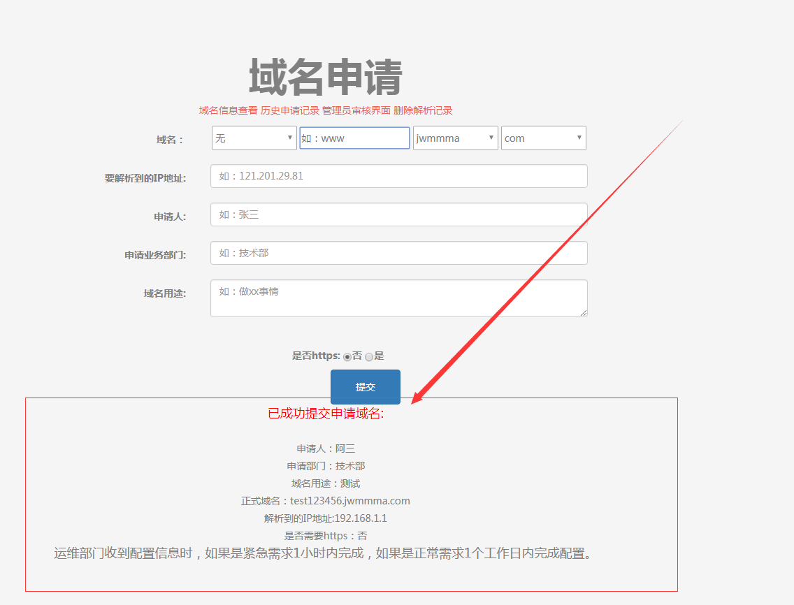
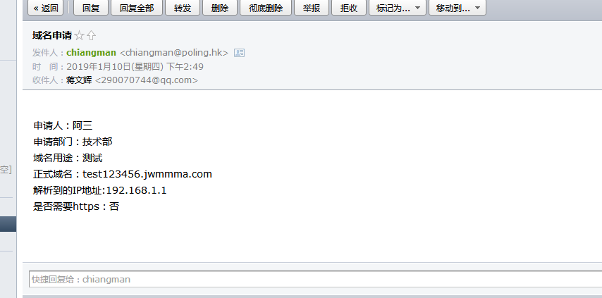
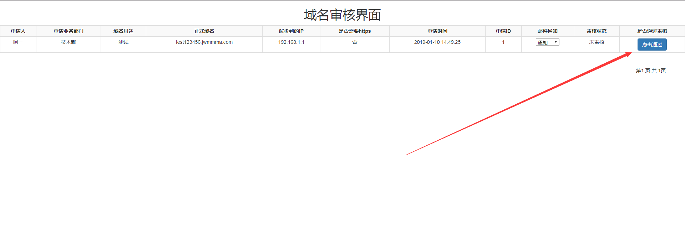

自动化域名解析管理
===

自动化阿里云域名解析系统开发： 用户在浏览器填写申请域名的表单提交到后台后，然后后台会把用户提交的申请域名的信息自动发邮件给运维主管并写入数据库，运维主管收到邮件核对无误后，进入后台管理页面，点击审核通过这个按钮，然后就会自动调用阿里云的API自动添加域名解析。
-

1.修改domain_registered/settings.py文件的最下面
-
    EMAIL_USE_TLS = False
    EMAIL_HOST = 'smtp地址  smtp.xxxxx.com'
    EMAIL_PORT = 25
    EMAIL_HOST_USER = '邮箱账号 zzz@xxxxxx.com'
    EMAIL_HOST_PASSWORD = '邮箱密码'
    DEFAULT_FROM_EMAIL = '申请域名 <admin@admin.con>'

2.修改app01/aliyun/阿里云api.py 
-
    AccessKeyId = 'xxxxx'  # "你的阿里云AccessKeyId"
    AccessKeySecret = 'xxxxxxxx'  # "你的阿里云AccessKeySecret "

3.启动
-
    python3 manage.py runserver 0:8000
浏览器访问 ip:8000/admin  
账号 root 密码 jiangwenhui

4.添加域名字段2表 , 如图
-

5.添加域名字段3表 , 如图
-

6.添加邮件接收人表
-

7.浏览器访问 ip:8000  
-

填写信息再提交如图

下图显示已经成功

查看是否有邮件通知，下图成功显示有邮件通知：

9.浏览器访问 ip:8000/Review  点击通过
-

10.nslookup 测试    如下图：
-

OK，这样就走完一套流程了